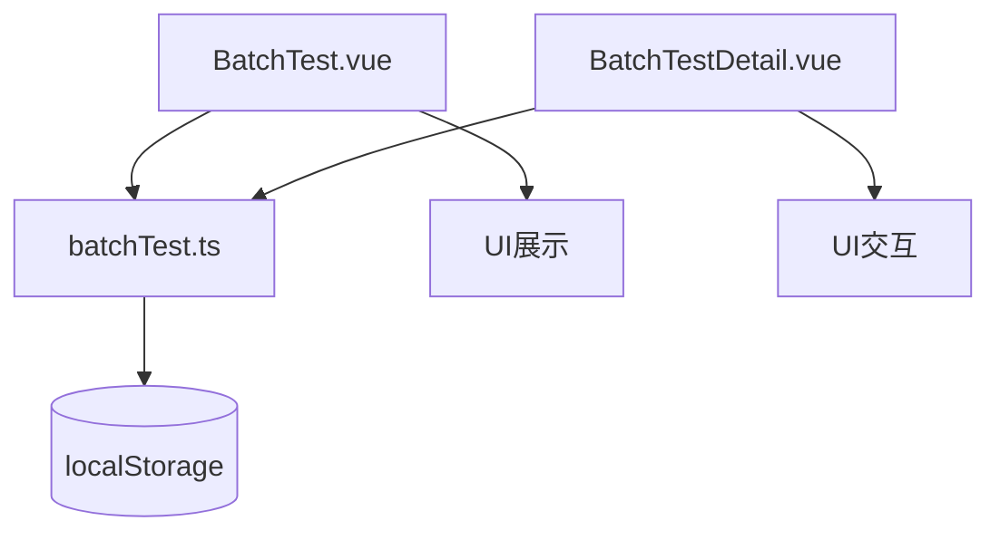
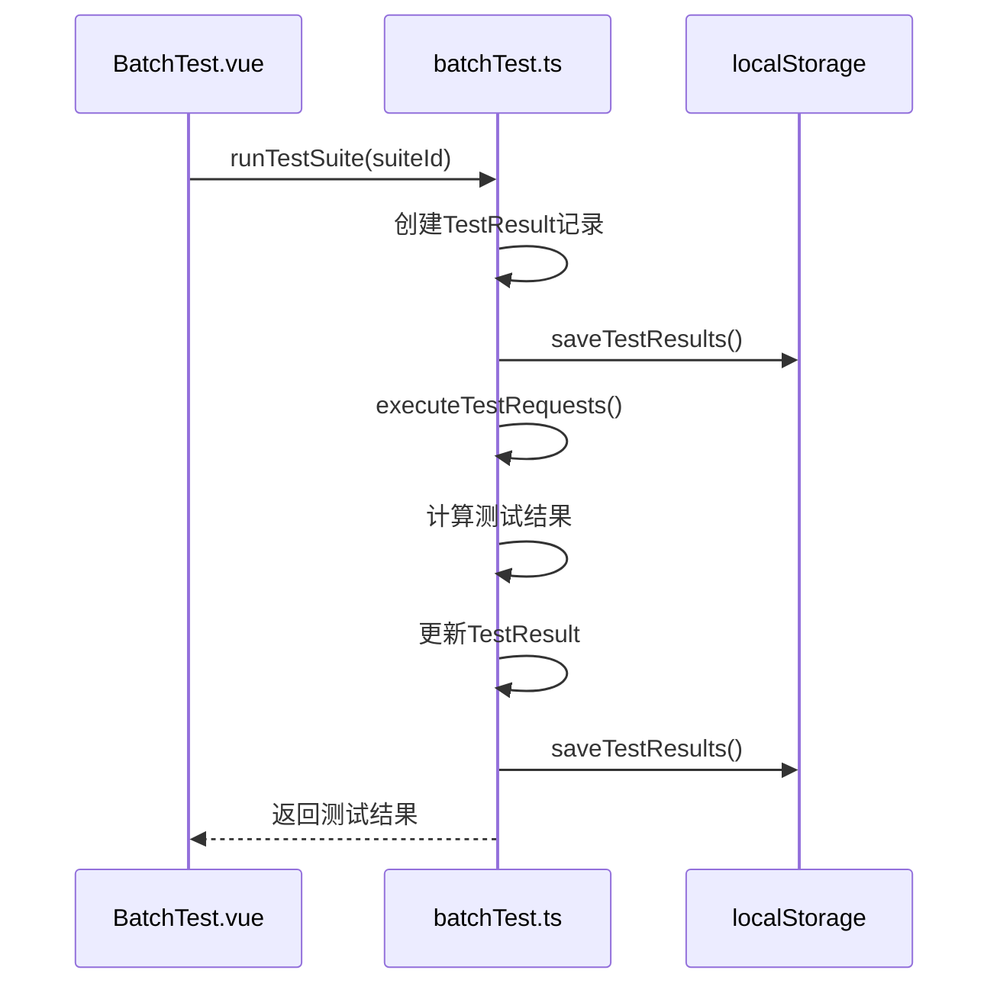
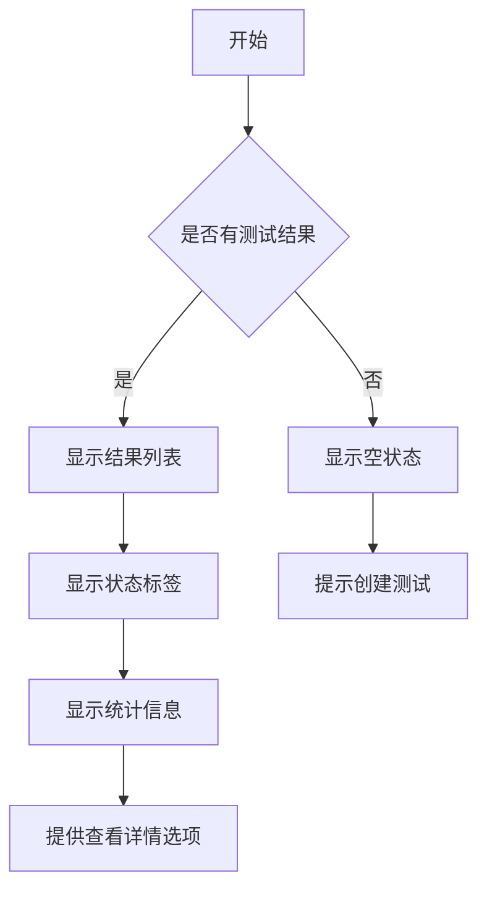
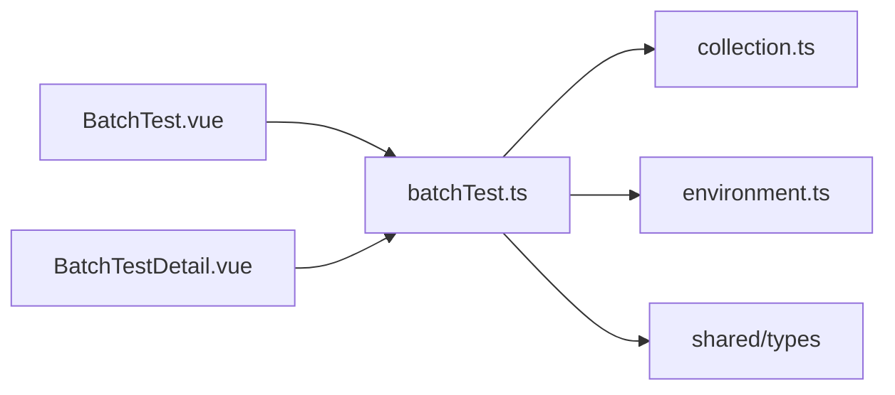

# 批量测试

<cite>
**本文档引用文件**  
- [BatchTest.vue](file://packages/web-full/src/pages/BatchTest.vue)
- [BatchTestDetail.vue](file://packages/web-full/src/pages/BatchTestDetail.vue)
- [batchTest.ts](file://packages/web-full/src/stores/batchTest.ts)
- [types/index.ts](file://packages/shared/types/index.ts)
</cite>

## 目录
1. [简介](#简介)
2. [项目结构](#项目结构)
3. [核心组件](#核心组件)
4. [架构概述](#架构概述)
5. [详细组件分析](#详细组件分析)
6. [依赖分析](#依赖分析)
7. [性能考量](#性能考量)
8. [故障排除指南](#故障排除指南)
9. [结论](#结论)

## 简介
批量测试功能允许用户创建和管理API测试套件，执行自动化测试。用户可以从接口集合中选择多个API进行串行或并行执行，支持参数化和断言验证。测试结果以可视化方式展示，包括成功率、响应时间分布等，并支持导出JSON/HTML报告。

## 项目结构
批量测试功能主要由以下文件组成：
- `BatchTest.vue`：批量测试主页面，展示测试套件列表和最近测试结果
- `BatchTestDetail.vue`：测试套件详情页面，包含测试请求、配置和结果
- `batchTest.ts`：状态管理模块，处理测试套件的创建、执行和结果存储

**Section sources**
- [BatchTest.vue](file://packages/web-full/src/pages/BatchTest.vue)
- [BatchTestDetail.vue](file://packages/web-full/src/pages/BatchTestDetail.vue)
- [batchTest.ts](file://packages/web-full/src/stores/batchTest.ts)

## 核心组件
批量测试功能的核心组件包括测试套件管理、测试执行引擎和结果分析。`BatchTest.vue`提供用户界面，`batchTest.ts`处理状态管理和测试执行逻辑。

**Section sources**
- [BatchTest.vue](file://packages/web-full/src/pages/BatchTest.vue)
- [batchTest.ts](file://packages/web-full/src/stores/batchTest.ts)

## 架构概述
批量测试功能采用Vue 3组合式API和Pinia状态管理。UI组件与状态管理分离，`batchTest.ts`存储测试套件和结果，提供创建、执行、删除等操作方法。



**Diagram sources**
- [BatchTest.vue](file://packages/web-full/src/pages/BatchTest.vue)
- [BatchTestDetail.vue](file://packages/web-full/src/pages/BatchTestDetail.vue)
- [batchTest.ts](file://packages/web-full/src/stores/batchTest.ts)

## 详细组件分析

### 测试套件管理
`BatchTest.vue`展示测试套件列表，支持搜索、筛选和创建新套件。用户可以运行、编辑、复制、导出或删除测试套件。

```mermaid
classDiagram
class BatchTest {
+searchQuery : string
+statusFilter : string
+testSuites : TestSuite[]
+recentTestResults : TestResult[]
+filteredTestSuites : ComputedRef
+openTestSuite(suite : TestSuite) : void
+runTestSuite(suiteId : string) : Promise
+handleSuiteAction(action : {action : string, suite : TestSuite}) : void
+createTestSuite() : Promise
}
```

**Diagram sources**
- [BatchTest.vue](file://packages/web-full/src/pages/BatchTest.vue)

### 测试执行流程
测试执行流程从用户点击"运行测试"开始，调用`batchTest.ts`中的`runTestSuite`方法，创建测试结果记录，执行测试请求，最后更新结果。



**Diagram sources**
- [batchTest.ts](file://packages/web-full/src/stores/batchTest.ts)

### 测试结果分析
`BatchTestDetail.vue`的"测试结果"标签页展示历史测试结果，包括状态、通过/失败数量、耗时等统计信息。



**Diagram sources**
- [BatchTestDetail.vue](file://packages/web-full/src/pages/BatchTestDetail.vue)

## 依赖分析
批量测试功能依赖以下模块：
- `collection.ts`：获取API集合用于测试
- `environment.ts`：获取测试环境配置
- `shared/types`：定义测试相关的类型



**Diagram sources**
- [batchTest.ts](file://packages/web-full/src/stores/batchTest.ts)
- [collection.ts](file://packages/web-full/src/stores/collection.ts)
- [environment.ts](file://packages/web-full/src/stores/environment.ts)

## 性能考量
批量测试功能在大规模测试时考虑了内存管理和进度反馈：
- 使用localStorage持久化存储测试套件和结果
- 通过`runningTests`数组跟踪正在运行的测试，提供运行中状态反馈
- 在执行测试请求时使用Promise.all进行并发控制

**Section sources**
- [batchTest.ts](file://packages/web-full/src/stores/batchTest.ts)

## 故障排除指南
常见问题及解决方案：
- **测试套件无法创建**：检查表单验证是否通过，确保必填字段已填写
- **测试执行失败**：查看错误信息，检查网络连接和API可用性
- **结果未保存**：确认localStorage是否可用，检查存储权限

**Section sources**
- [batchTest.ts](file://packages/web-full/src/stores/batchTest.ts)

## 结论
批量测试功能提供了完整的API测试解决方案，从测试套件创建到执行、结果分析和报告导出。通过清晰的架构设计和状态管理，确保了功能的可维护性和扩展性。