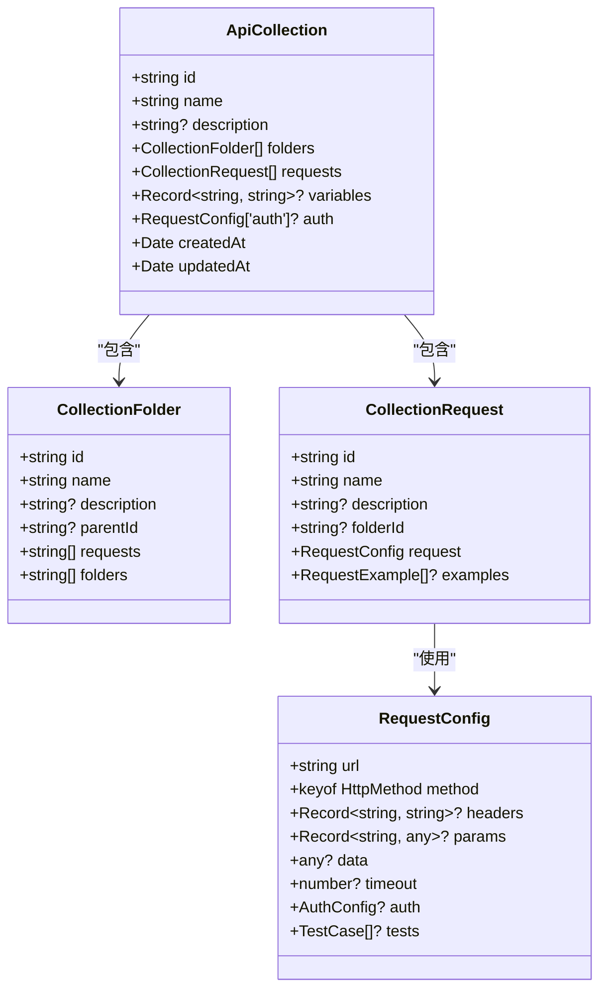

# 接口集合管理

<cite>
**本文档引用的文件**  
- [CollectionTree.vue](file://packages/web-full/src/components/CollectionTree.vue)
- [CollectionDialog.vue](file://packages/web-full/src/components/CollectionDialog.vue)
- [collection.ts](file://packages/web-full/src/stores/collection.ts)
- [index.ts](file://packages/shared/types/index.ts)
- [workspace.ts](file://packages/web-full/src/stores/workspace.ts)
</cite>

## 目录
1. [接口集合管理](#接口集合管理)
2. [集合创建与元数据编辑](#集合创建与元数据编辑)
3. [树形结构渲染逻辑](#树形结构渲染逻辑)
4. [数据模型与状态管理](#数据模型与状态管理)
5. [集合与环境、工作区的关联](#集合与环境工作区的关联)
6. [实际使用案例](#实际使用案例)
7. [数据同步与性能优化](#数据同步与性能优化)
8. [常见问题解决方案](#常见问题解决方案)

## 集合创建与元数据编辑

接口集合的创建和编辑功能通过 `CollectionDialog.vue` 组件实现。该组件提供了一个模态对话框，用于收集集合的元数据信息。当用户点击“新建集合”或“编辑集合”时，会触发该组件的显示。

组件接收两个主要属性：`modelValue` 控制对话框的显示与隐藏，`collection` 用于判断当前是创建还是编辑操作。在编辑模式下，表单会预填充现有集合的信息；在创建模式下，表单为空白状态。

表单包含以下字段：
- **集合名称**：必填项，长度限制在1-50个字符之间。
- **描述**：可选项，用于对集合进行详细说明，长度限制在200个字符以内。

表单验证通过 Element Plus 的 `Form` 组件实现，确保用户输入符合要求。提交时，组件会验证表单数据，生成包含唯一ID、创建时间和更新时间的集合对象，并通过 `save` 事件将数据提交给父组件。成功后，会显示相应的成功消息。

**Section sources**
- [CollectionDialog.vue](file://packages/web-full/src/components/CollectionDialog.vue#L1-L172)

## 树形结构渲染逻辑

`CollectionTree.vue` 组件负责渲染接口集合的树形结构。该组件接收一个 `collections` 数组作为输入，并将其转换为适合 `el-tree` 组件使用的树形数据结构。

树形数据的构建通过 `treeData` 计算属性完成。该属性遍历 `collections` 数组，为每个集合创建一个根节点，并递归地构建其子节点（文件夹和请求）。每个节点包含以下信息：
- `id`：节点的唯一标识符。
- `label`：节点显示的文本。
- `type`：节点类型（集合、文件夹或请求）。
- `method`：对于请求节点，显示其HTTP方法。
- `data`：存储原始数据对象，便于后续操作。

树形结构支持以下交互功能：
- **节点点击**：当用户点击一个请求节点时，会触发 `select-request` 事件，将请求数据传递给父组件。
- **右键菜单**：集合节点提供一个下拉菜单，支持添加请求、添加文件夹、编辑、复制、导出和删除等操作。
- **空状态提示**：当没有集合时，显示一个友好的提示信息，并提供创建集合的按钮。

**Section sources**
- [CollectionTree.vue](file://packages/web-full/src/components/CollectionTree.vue#L1-L327)

## 数据模型与状态管理

接口集合的数据模型定义在 `@shared/types/index.ts` 文件中，主要包括以下三个核心类型：

- **ApiCollection**：表示一个接口集合，包含ID、名称、描述、文件夹、请求、变量、认证信息以及创建和更新时间。
- **CollectionFolder**：表示集合中的文件夹，包含ID、名称、描述、父文件夹ID、请求ID列表和子文件夹ID列表。
- **CollectionRequest**：表示一个具体的API请求，包含ID、名称、描述、所属文件夹ID、请求配置和示例。

状态管理由 `collection.ts` 中的 Pinia store 负责。该 store 管理以下状态：
- `collections`：存储所有集合的数组。
- `currentCollection`：当前选中的集合。
- `currentRequest`：当前选中的请求。
- `requestHistory`：请求历史记录。
- `testResults` 和 `batchTestResults`：测试结果。

store 提供了一系列 CRUD 操作方法，包括 `createCollection`、`updateCollection`、`deleteCollection`、`createFolder`、`createRequest` 等。这些方法不仅更新本地状态，还会调用 `workspaceStore` 记录操作日志，并将数据持久化到 `localStorage`。



**Diagram sources**
- [index.ts](file://packages/shared/types/index.ts#L1-L991)

**Section sources**
- [collection.ts](file://packages/web-full/src/stores/collection.ts#L1-L809)
- [index.ts](file://packages/shared/types/index.ts#L1-L991)

## 集合与环境、工作区的关联

接口集合与环境和工作区之间存在紧密的关联关系，这种关系通过 `workspace.ts` 中的 `useWorkspaceStore` 实现。

**工作区（Workspace）** 是最高层级的组织单元，一个工作区可以包含多个集合和环境。`Workspace` 类型定义了工作区的基本属性，如ID、名称、描述、集合ID列表、环境ID列表、所有者、成员等。通过 `createWorkspace` 和 `switchWorkspace` 方法，用户可以创建和切换不同的工作区。

**环境（Environment）** 用于管理API请求的上下文，如基础URL、变量和认证信息。`Environment` 类型定义了环境的名称、变量、激活状态等。`activateEnvironment` 方法允许用户在不同环境之间切换，确保请求使用正确的配置。

集合、环境和工作区之间的关系如下：
- 一个工作区包含多个集合和环境。
- 一个集合可以被多个工作区引用，实现跨项目复用。
- 一个请求在执行时，会结合当前激活的环境变量进行参数替换。

这种设计使得用户可以在不同的项目中复用相同的集合，同时通过切换环境来适应不同的部署场景（如开发、测试、生产）。

```mermaid
erDiagram
WORKSPACE {
string id PK
string name
string description
string[] collections FK
string[] environments FK
string ownerId
string[] members
boolean isPublic
WorkspaceSettings settings
datetime createdAt
datetime updatedAt
}
ENVIRONMENT {
string id PK
string name
Record~string, string~ variables
boolean isActive
string? baseUrl
RequestConfig['auth']? auth
datetime createdAt
datetime updatedAt
}
COLLECTION {
string id PK
string name
string? description
CollectionFolder[] folders
CollectionRequest[] requests
Record~string, string~? variables
RequestConfig['auth']? auth
datetime createdAt
datetime updatedAt
}
WORKSPACE ||--o{ COLLECTION : "包含"
WORKSPACE ||--o{ ENVIRONMENT : "包含"
COLLECTION ||--o{ REQUEST : "包含"
```

**Diagram sources**
- [workspace.ts](file://packages/web-full/src/stores/workspace.ts#L1-L810)
- [index.ts](file://packages/shared/types/index.ts#L1-L991)

## 实际使用案例

### 按业务模块组织API

用户可以创建多个集合来组织不同业务模块的API。例如：
- **用户管理API**：包含用户注册、登录、个人信息管理等接口。
- **订单系统API**：包含订单创建、查询、支付等接口。
- **支付网关API**：包含第三方支付接口集成测试。

每个集合内部，可以使用文件夹进一步组织请求。例如，在“用户管理API”集合中，可以创建“注册登录”、“个人信息”、“权限管理”等文件夹。

### 团队共享集合

通过工作区的共享功能，团队成员可以协作管理API集合。具体流程如下：
1. 创建一个共享工作区，并邀请团队成员加入。
2. 在工作区内创建集合，并设置适当的权限（如只读或可编辑）。
3. 团队成员可以在自己的客户端中切换到该工作区，查看和使用集合。

这种方式确保了团队内部API文档的一致性，避免了重复工作。

## 数据同步与性能优化

### 数据同步机制

集合数据的同步主要通过 `localStorage` 实现。`collection.ts` 中的 `loadCollections` 和 `saveCollections` 方法负责从 `localStorage` 加载和保存集合数据。此外，`watch` 监听器确保当 `collections` 状态发生变化时，自动调用 `saveCollections` 进行持久化。

对于跨设备同步，系统提供了导入导出功能。`importCollection` 和 `exportCollection` 方法支持多种格式（如Postman、OpenAPI、Insomnia），方便用户在不同工具之间迁移数据。

### 版本控制考虑

虽然当前实现没有内置的版本控制系统，但可以通过以下方式实现简单的版本管理：
- **导出备份**：定期导出集合为JSON文件，作为备份。
- **Git集成**：将导出的JSON文件提交到Git仓库，利用Git进行版本控制。

### 性能优化策略

- **懒加载**：树形结构默认只加载集合的顶层节点，文件夹和请求在展开时才加载。
- **缓存**：使用 `localStorage` 缓存集合数据，减少重复加载的时间。
- **搜索过滤**：通过 `filteredCollections` 计算属性实现客户端搜索，避免频繁的服务器请求。

## 常见问题解决方案

### 数据丢失

**问题**：由于意外关闭浏览器或设备故障，导致未保存的集合数据丢失。

**解决方案**：
1. 启用自动保存功能，确保每次修改后立即持久化到 `localStorage`。
2. 定期导出集合为JSON文件，作为额外的备份。
3. 使用云存储服务（如GitHub）进行远程备份。

### 同步冲突

**问题**：多个用户同时编辑同一个集合，导致数据冲突。

**解决方案**：
1. 实现乐观锁机制，在更新集合时检查 `updatedAt` 时间戳，如果发现冲突，则提示用户手动合并。
2. 使用分布式版本控制系统（如Git），通过分支和合并解决冲突。
3. 在UI层面提供实时协作功能，显示其他用户的编辑状态。