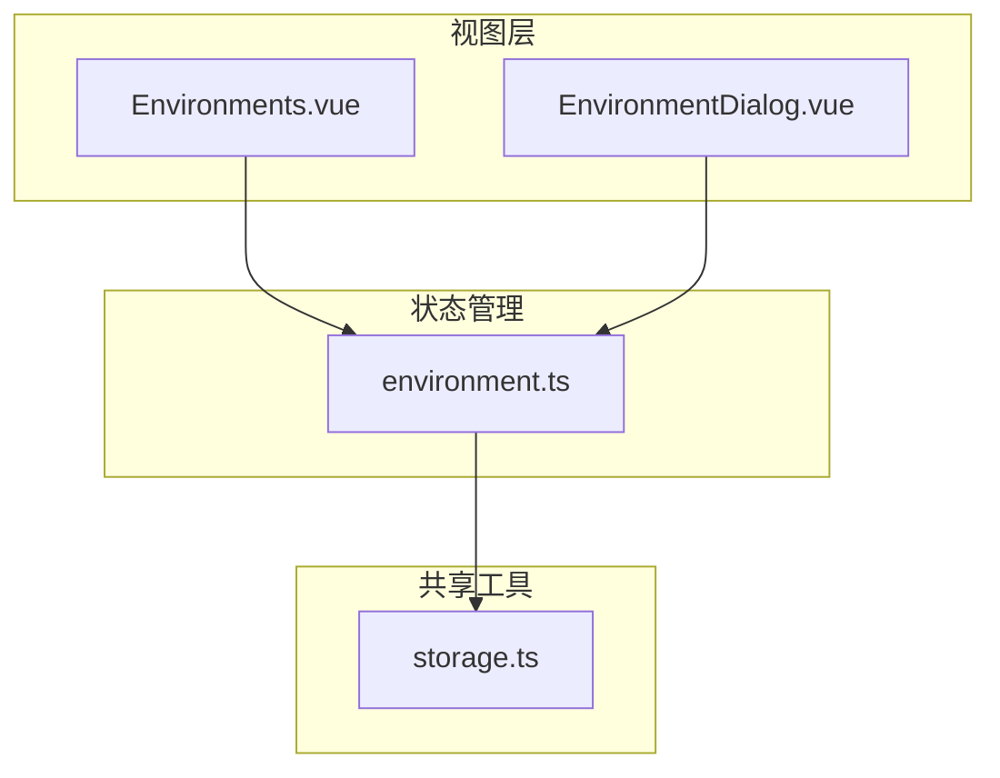
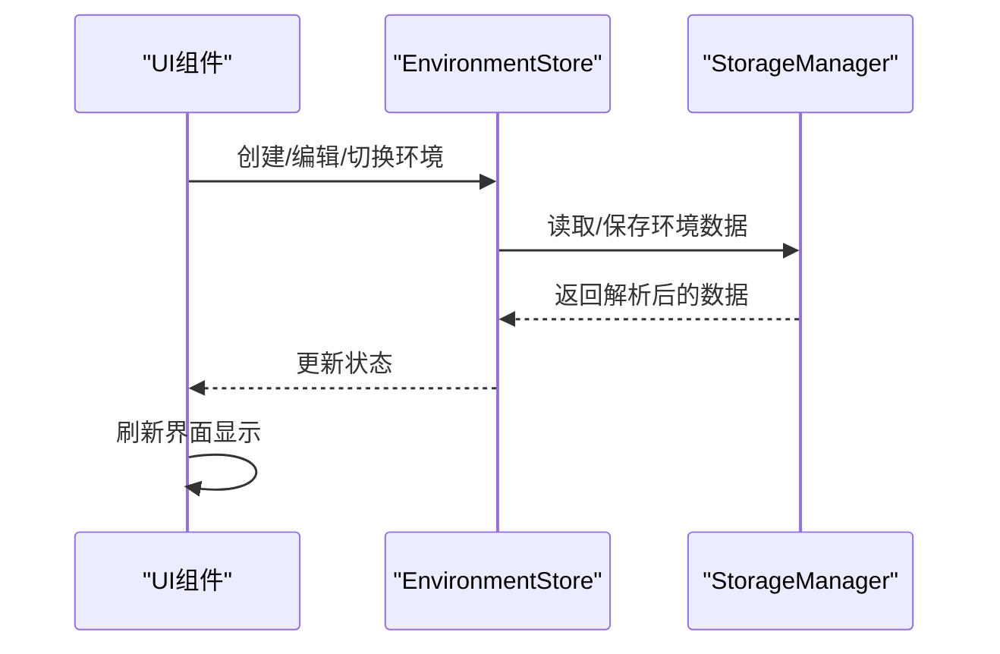
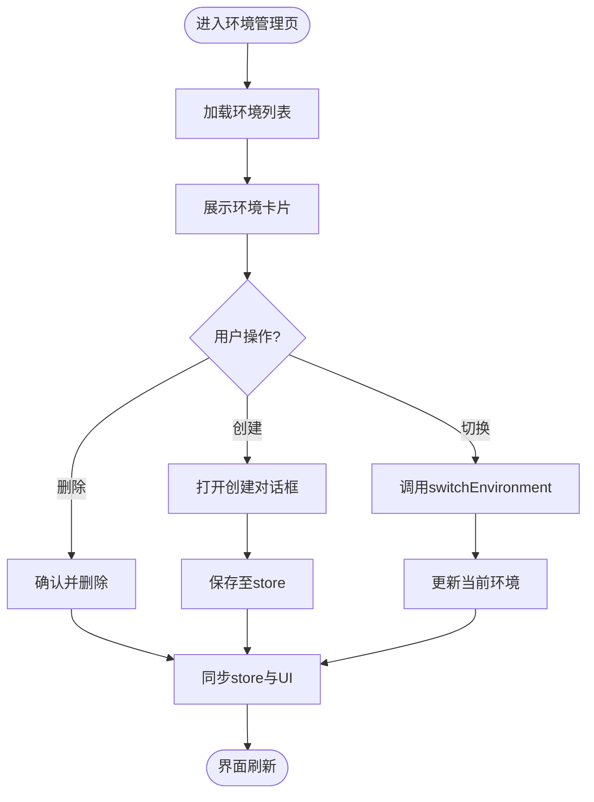
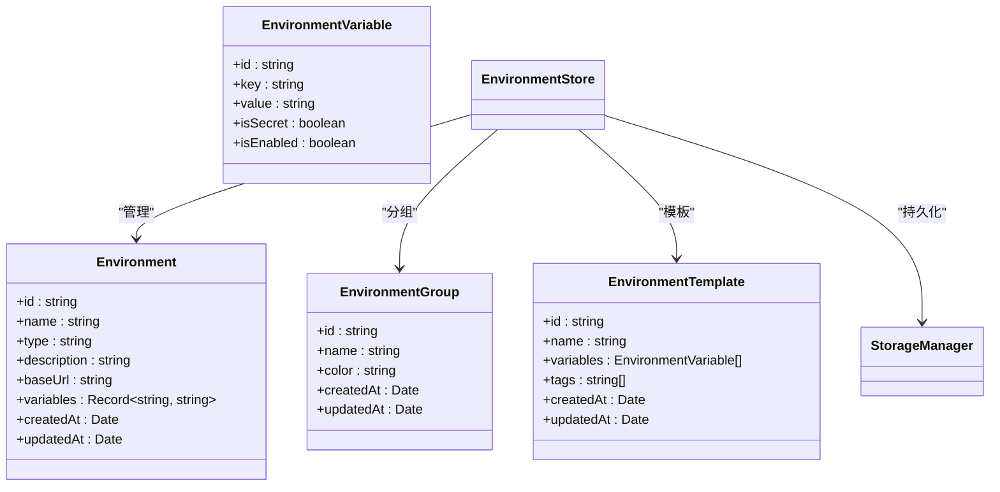
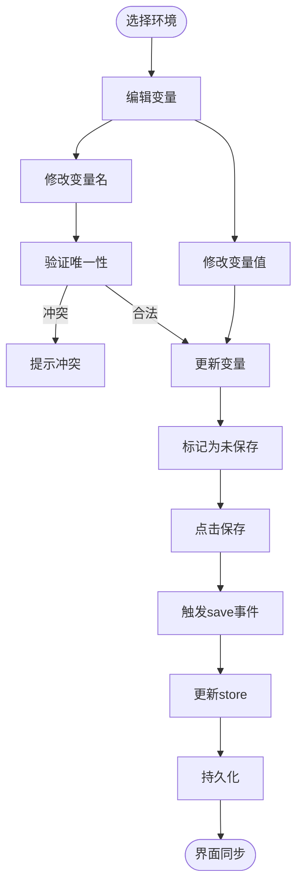
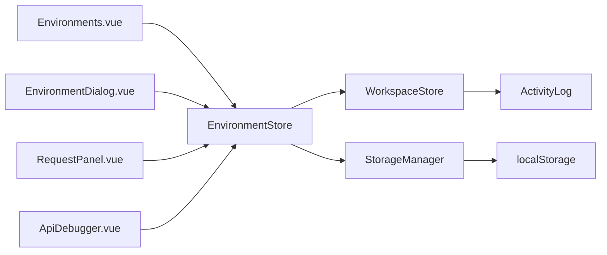

# 环境管理

<cite>
**本文档引用的文件**  
- [Environments.vue](file://packages/web-full/src/views/Environments.vue)
- [environment.ts](file://packages/web-full/src/stores/environment.ts)
- [EnvironmentDialog.vue](file://packages/web-full/src/components/EnvironmentDialog.vue)
- [storage.ts](file://packages/shared/utils/storage.ts)
</cite>

## 目录
1. [简介](#简介)
2. [项目结构](#项目结构)
3. [核心组件](#核心组件)
4. [架构概述](#架构概述)
5. [详细组件分析](#详细组件分析)
6. [依赖分析](#依赖分析)
7. [性能考虑](#性能考虑)
8. [故障排除指南](#故障排除指南)
9. [结论](#结论)

## 简介
本文档详细说明了在线接口调试工具中的环境管理功能，涵盖环境变量的创建、编辑、切换和作用域管理。基于 `Environments.vue` 页面和 `environment.ts` 状态管理模块，阐述多环境配置的实现机制，以及环境变量如何在 API 请求中动态注入以支持开发、测试和生产等不同场景。结合 `EnvironmentDialog.vue` 组件说明 UI 交互设计，包括变量分组、作用域继承和冲突提示。同时提供典型使用场景示例，如跨环境快速切换调试，并说明敏感信息加密存储机制（通过 `storage` 工具），指导用户避免配置错误。

## 项目结构
环境管理功能分布在多个模块中，主要涉及视图层、状态管理、组件和共享工具。整体结构如下：

**Diagram sources**  
- [Environments.vue](file://packages/web-full/src/views/Environments.vue#L1-L415)
- [environment.ts](file://packages/web-full/src/stores/environment.ts#L1-L1025)
- [EnvironmentDialog.vue](file://packages/web-full/src/components/EnvironmentDialog.vue#L1-L393)
- [storage.ts](file://packages/shared/utils/storage.ts#L1-L55)

**Section sources**
- [Environments.vue](file://packages/web-full/src/views/Environments.vue#L1-L415)
- [environment.ts](file://packages/web-full/src/stores/environment.ts#L1-L1025)

## 核心组件
环境管理功能由三大核心组件构成：视图组件 `Environments.vue` 负责展示环境列表和操作入口；状态管理模块 `environment.ts` 实现环境数据的持久化、切换和变量注入；对话框组件 `EnvironmentDialog.vue` 提供环境的编辑与变量管理界面。

**Section sources**
- [Environments.vue](file://packages/web-full/src/views/Environments.vue#L1-L415)
- [environment.ts](file://packages/web-full/src/stores/environment.ts#L1-L1025)
- [EnvironmentDialog.vue](file://packages/web-full/src/components/EnvironmentDialog.vue#L1-L393)

## 架构概述
环境管理采用典型的 MVVM 架构模式，通过 Pinia 状态管理实现数据与视图的解耦。用户操作通过 UI 组件触发，状态变更由 store 统一处理并持久化至本地存储。

**Diagram sources**  
- [environment.ts](file://packages/web-full/src/stores/environment.ts#L1-L1025)
- [storage.ts](file://packages/shared/utils/storage.ts#L1-L55)

## 详细组件分析

### 环境视图组件分析
`Environments.vue` 是环境管理的主页面，提供环境列表展示、创建、切换和删除功能。支持按类型（开发、测试、生产）分类显示，并展示各环境的变量数量和基础信息。

#### 组件交互流程

**Diagram sources**  
- [Environments.vue](file://packages/web-full/src/views/Environments.vue#L1-L415)

**Section sources**
- [Environments.vue](file://packages/web-full/src/views/Environments.vue#L1-L415)

### 状态管理模块分析
`environment.ts` 是环境管理的核心逻辑模块，使用 Pinia 实现状态管理，封装了环境的增删改查、变量管理、模板应用和数据导入导出功能。

#### 状态结构定义

**Diagram sources**  
- [environment.ts](file://packages/web-full/src/stores/environment.ts#L1-L1025)

**Section sources**
- [environment.ts](file://packages/web-full/src/stores/environment.ts#L1-L1025)

### 环境编辑对话框分析
`EnvironmentDialog.vue` 提供环境的集中编辑界面，支持环境变量的添加、删除、重命名和值修改，具备实时保存和重置功能。

#### 变量编辑流程

**Diagram sources**  
- [EnvironmentDialog.vue](file://packages/web-full/src/components/EnvironmentDialog.vue#L1-L393)

**Section sources**
- [EnvironmentDialog.vue](file://packages/web-full/src/components/EnvironmentDialog.vue#L1-L393)

## 依赖分析
环境管理模块与其他系统模块存在明确依赖关系，确保功能完整性和数据一致性。

**Diagram sources**  
- [environment.ts](file://packages/web-full/src/stores/environment.ts#L1-L1025)
- [Environments.vue](file://packages/web-full/src/views/Environments.vue#L1-L415)
- [EnvironmentDialog.vue](file://packages/web-full/src/components/EnvironmentDialog.vue#L1-L393)

**Section sources**
- [environment.ts](file://packages/web-full/src/stores/environment.ts#L1-L1025)

## 性能考虑
环境管理功能在性能方面做了以下优化：
- 使用计算属性 `filteredEnvironments` 实现高效搜索过滤
- 批量操作避免频繁持久化
- 变更检测仅在用户主动保存时触发
- 大量环境数据采用懒加载策略

## 故障排除指南
### 常见问题
- **环境切换无效**：检查 `currentEnvironment` 是否正确更新，确认 `saveCurrentEnvironment` 是否执行
- **变量未生效**：确保变量名拼写正确，检查是否被其他环境覆盖
- **数据丢失**：确认 `localStorage` 写入权限，检查 `storage.set` 是否抛出异常
- **导入失败**：验证导入数据格式是否符合 JSON/Env/Postman 规范

### 调试建议
- 使用浏览器开发者工具查看 `localStorage` 中以 `api-debug-tool:` 开头的键值
- 检查控制台是否有 `Storage error` 日志
- 验证 `useEnvironmentStore` 是否正确初始化

**Section sources**
- [environment.ts](file://packages/web-full/src/stores/environment.ts#L1-L1025)
- [storage.ts](file://packages/shared/utils/storage.ts#L1-L55)

## 结论
环境管理功能通过清晰的分层架构实现了多环境配置的完整生命周期管理。基于 Pinia 的状态管理确保了数据一致性，结合 `StorageManager` 实现了安全的本地持久化。UI 组件提供直观的操作界面，支持高效开发调试。建议用户合理规划环境命名和变量结构，避免命名冲突，并利用模板功能提升配置复用率。