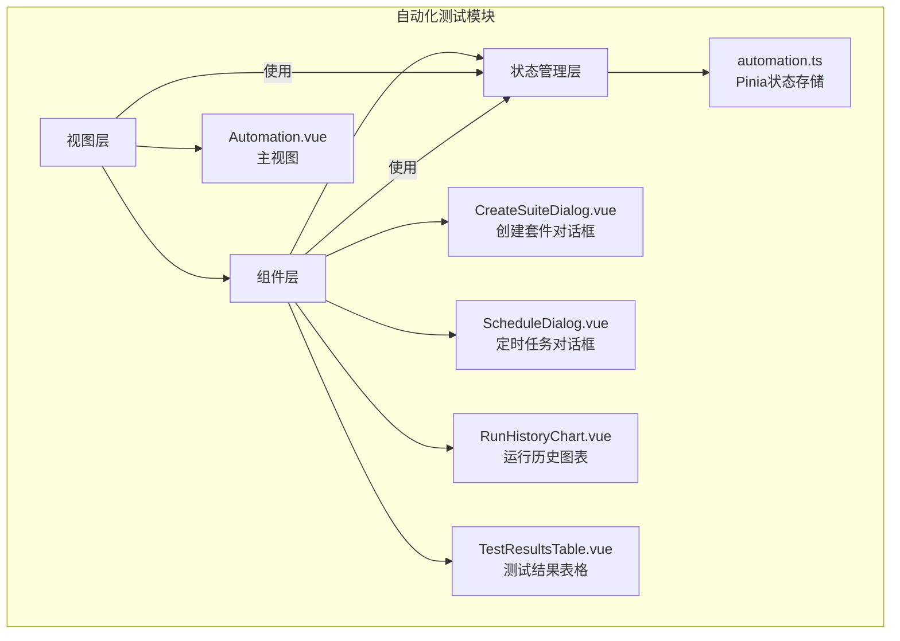
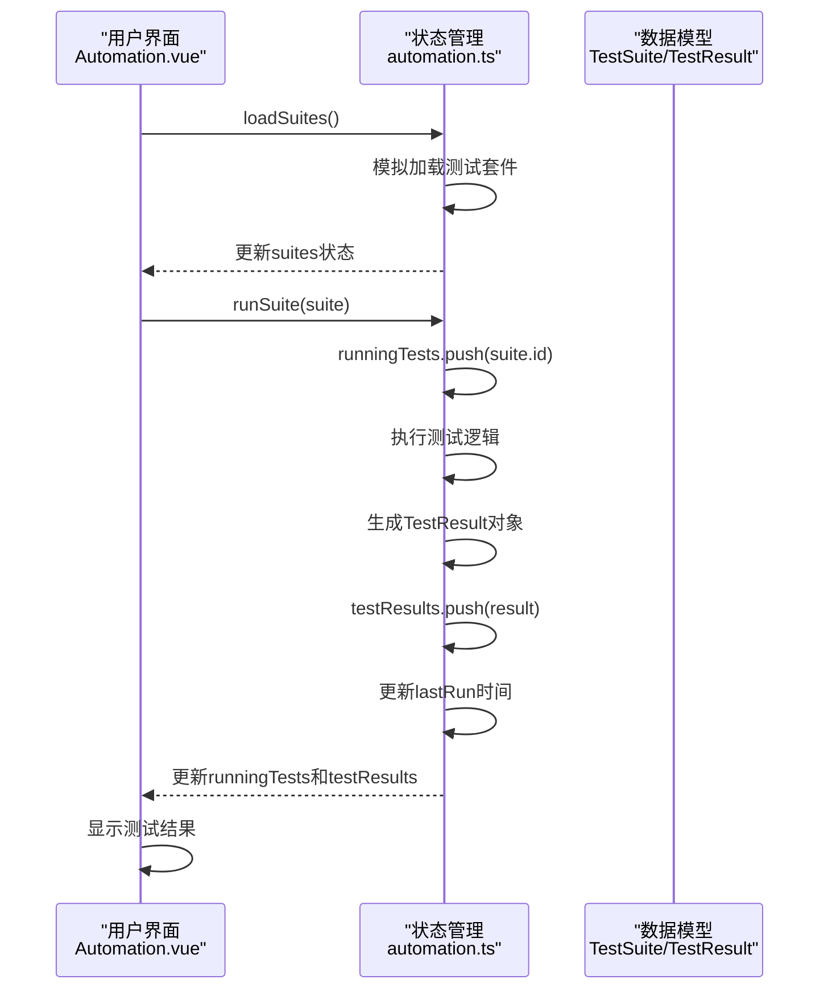
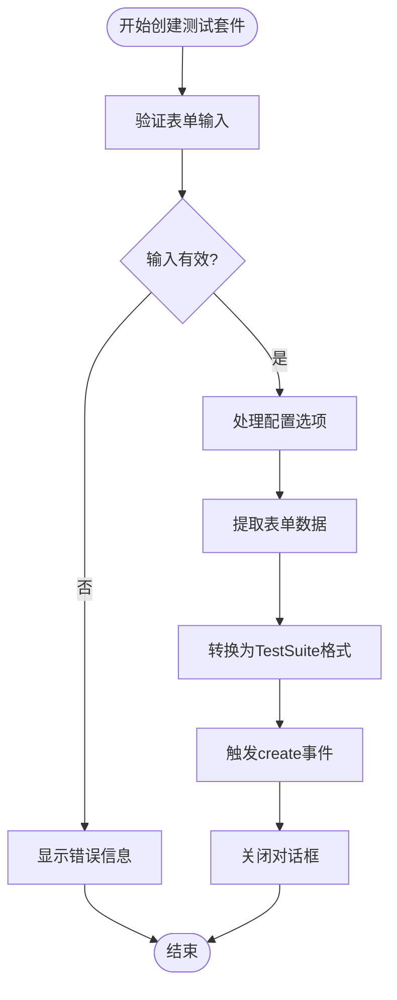
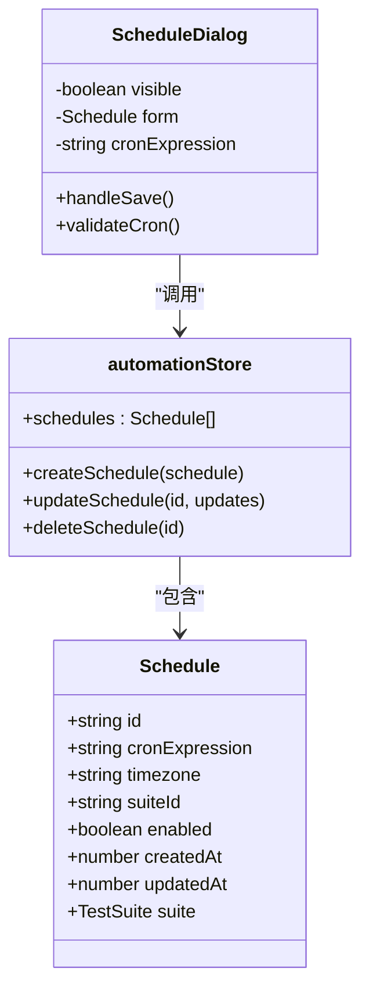
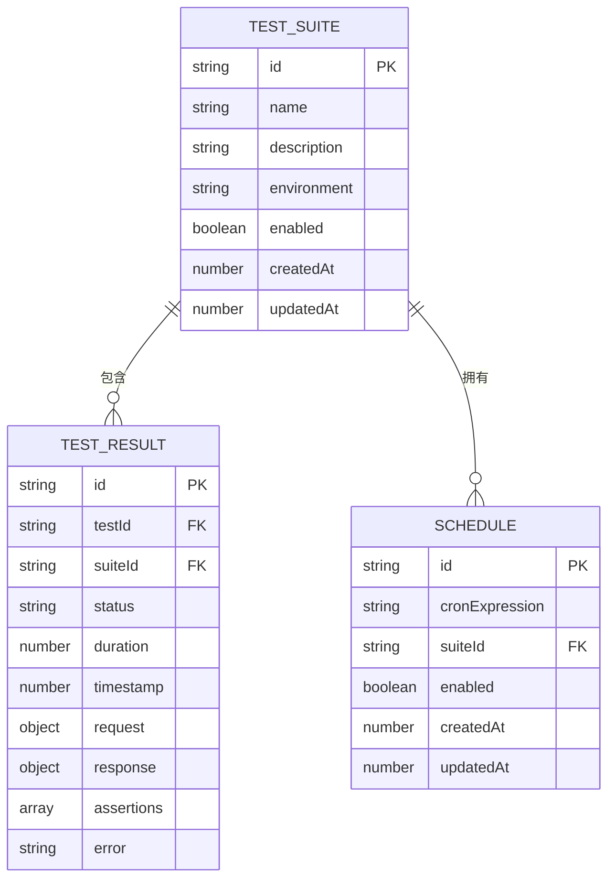
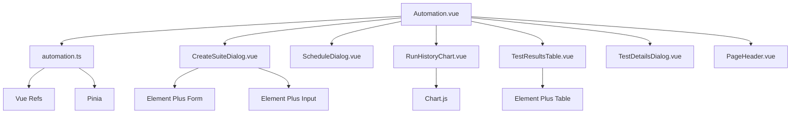

# 自动化测试

<cite>
**本文档引用的文件**
- [Automation.vue](file://packages/web-pro/src/views/Automation.vue)
- [automation.ts](file://packages/web-pro/src/stores/automation.ts)
- [CreateSuiteDialog.vue](file://packages/web-pro/src/components/automation/CreateSuiteDialog.vue)
- [ScheduleDialog.vue](file://packages/web-pro/src/components/automation/ScheduleDialog.vue)
- [RunHistoryChart.vue](file://packages/web-pro/src/components/automation/RunHistoryChart.vue)
- [TestResultsTable.vue](file://packages/web-pro/src/components/automation/TestResultsTable.vue)
</cite>

## 目录
1. [简介](#简介)
2. [项目结构](#项目结构)
3. [核心组件](#核心组件)
4. [架构概览](#架构概览)
5. [详细组件分析](#详细组件分析)
6. [依赖分析](#依赖分析)
7. [性能考虑](#性能考虑)
8. [故障排除指南](#故障排除指南)
9. [结论](#结论)

## 简介
本技术文档深入解析在线接口调试工具中的自动化测试模块，涵盖测试套件创建、测试计划编排、定时任务设置和执行结果分析等核心功能。文档基于`Automation.vue`视图组件和`automation.ts`状态管理模块，详细说明自动化流程的配置界面、调度机制与状态机设计。同时，文档还描述了定时任务的Cron表达式支持、执行日志记录、失败告警机制以及测试结果的图表化展示方式，为开发者提供自动化引擎的后台运行原理、资源隔离策略及与CI/CD系统集成的完整技术视图。

## 项目结构
自动化测试模块位于`web-pro`包中，采用典型的Vue 3 + Pinia架构，包含视图、组件和状态管理三个主要部分。该模块通过清晰的目录结构实现了功能的高内聚和低耦合。

**图示来源**
- [Automation.vue](file://packages/web-pro/src/views/Automation.vue)
- [automation.ts](file://packages/web-pro/src/stores/automation.ts)
- [CreateSuiteDialog.vue](file://packages/web-pro/src/components/automation/CreateSuiteDialog.vue)
- [ScheduleDialog.vue](file://packages/web-pro/src/components/automation/ScheduleDialog.vue)

**本节来源**
- [Automation.vue](file://packages/web-pro/src/views/Automation.vue)
- [automation.ts](file://packages/web-pro/src/stores/automation.ts)

## 核心组件
自动化测试模块的核心由视图组件`Automation.vue`和状态管理模块`automation.ts`构成。`Automation.vue`负责提供用户交互界面，包括测试套件列表、运行历史图表和测试结果表格，而`automation.ts`则管理所有测试相关的状态和业务逻辑，如测试套件、测试结果、定时任务和系统设置。两者通过Pinia的`useAutomationStore`进行数据绑定和方法调用，实现了视图与逻辑的完全分离。该模块还包含多个可复用的UI组件，如`CreateSuiteDialog`和`ScheduleDialog`，用于创建和配置复杂的测试任务。

**本节来源**
- [Automation.vue](file://packages/web-pro/src/views/Automation.vue#L1-L525)
- [automation.ts](file://packages/web-pro/src/stores/automation.ts#L1-L416)

## 架构概览
自动化测试模块采用分层架构设计，上层为用户界面，中层为状态管理，底层为数据模型。用户通过`Automation.vue`视图发起操作，视图组件调用`automation.ts`中的方法，状态管理模块处理业务逻辑并更新状态，最终视图根据最新的状态重新渲染。

**图示来源**
- [Automation.vue](file://packages/web-pro/src/views/Automation.vue#L1-L525)
- [automation.ts](file://packages/web-pro/src/stores/automation.ts#L1-L416)

## 详细组件分析
本节将深入分析自动化测试模块的关键组件，包括其功能、交互逻辑和内部实现。

### 测试套件创建分析
`CreateSuiteDialog`组件提供了一个完整的表单界面，用于创建新的测试套件。用户可以配置套件的基本信息、环境设置、执行参数和通知策略。

**图示来源**
- [CreateSuiteDialog.vue](file://packages/web-pro/src/components/automation/CreateSuiteDialog.vue#L1-L327)

**本节来源**
- [CreateSuiteDialog.vue](file://packages/web-pro/src/components/automation/CreateSuiteDialog.vue#L1-L327)
- [automation.ts](file://packages/web-pro/src/stores/automation.ts#L1-L416)

### 定时任务配置分析
`ScheduleDialog`组件（虽未提供源码，但可从`Automation.vue`推断）用于管理测试套件的定时执行计划。它支持Cron表达式，允许用户精确控制测试的执行时间。

**图示来源**
- [ScheduleDialog.vue](file://packages/web-pro/src/components/automation/ScheduleDialog.vue)
- [automation.ts](file://packages/web-pro/src/stores/automation.ts#L1-L416)

### 测试结果分析
`RunHistoryChart`和`TestResultsTable`组件共同提供了测试结果的可视化分析。`RunHistoryChart`以折线图形式展示通过率趋势，而`TestResultsTable`则以表格形式列出详细的测试执行记录。

**图示来源**
- [RunHistoryChart.vue](file://packages/web-pro/src/components/automation/RunHistoryChart.vue)
- [TestResultsTable.vue](file://packages/web-pro/src/components/automation/TestResultsTable.vue)
- [automation.ts](file://packages/web-pro/src/stores/automation.ts#L1-L416)

**本节来源**
- [RunHistoryChart.vue](file://packages/web-pro/src/components/automation/RunHistoryChart.vue)
- [TestResultsTable.vue](file://packages/web-pro/src/components/automation/TestResultsTable.vue)
- [automation.ts](file://packages/web-pro/src/stores/automation.ts#L1-L416)

## 依赖分析
自动化测试模块依赖于多个外部库和内部模块。前端使用Vue 3和Element Plus构建UI，Pinia进行状态管理。模块内部，`Automation.vue`依赖于`automation.ts`存储和多个子组件，形成了清晰的依赖关系。

**图示来源**
- [Automation.vue](file://packages/web-pro/src/views/Automation.vue#L1-L525)
- [automation.ts](file://packages/web-pro/src/stores/automation.ts#L1-L416)
- [CreateSuiteDialog.vue](file://packages/web-pro/src/components/automation/CreateSuiteDialog.vue#L1-L327)

**本节来源**
- [Automation.vue](file://packages/web-pro/src/views/Automation.vue#L1-L525)
- [automation.ts](file://packages/web-pro/src/stores/automation.ts#L1-L416)

## 性能考虑
自动化测试模块在设计时考虑了性能因素。状态管理模块使用计算属性（如`activeSuites`、`successRate`）来缓存派生数据，避免重复计算。测试执行采用异步非阻塞方式，通过`runningTests`数组管理并发状态，防止同一套件被重复执行。对于大量测试结果数据，模块提供了`exportResults`方法，支持JSON、CSV和HTML格式导出，便于离线分析。

## 故障排除指南
当自动化测试模块出现问题时，可参考以下步骤进行排查：
1. 检查`automation.ts`中的`loading`状态，确认数据加载是否正常完成。
2. 查看浏览器控制台是否有JavaScript错误，特别是Pinia状态更新相关的错误。
3. 验证`CreateSuiteDialog`表单的验证规则是否正确触发。
4. 检查定时任务的Cron表达式格式是否正确。
5. 确认测试结果数据是否正确地从`runSuite`方法推送到`testResults`数组中。

**本节来源**
- [automation.ts](file://packages/web-pro/src/stores/automation.ts#L1-L416)
- [CreateSuiteDialog.vue](file://packages/web-pro/src/components/automation/CreateSuiteDialog.vue#L1-L327)

## 结论
自动化测试模块通过`Automation.vue`视图和`automation.ts`状态管理的紧密结合，提供了一套完整、易用的测试自动化解决方案。模块设计清晰，职责分明，易于扩展和维护。未来可进一步增强的功能包括：更复杂的Cron表达式解析、与外部CI/CD系统的Webhook集成、以及更丰富的测试结果分析图表。