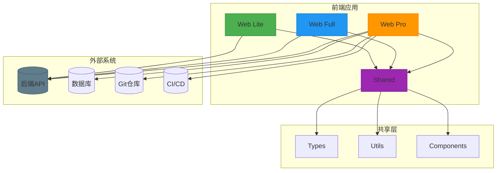

# 项目概述

<cite>
**本文档引用的文件**
- [README.md](file://README.md)
- [shared/types/index.ts](file://packages/shared/types/index.ts)
- [shared/utils/index.ts](file://packages/shared/utils/index.ts)
- [shared/package.json](file://packages/shared/package.json)
- [web-lite/src/main.ts](file://packages/web-lite/src/main.ts)
- [web-lite/package.json](file://packages/web-lite/package.json)
- [web-full/src/main.ts](file://packages/web-full/src/main.ts)
- [web-full/package.json](file://packages/web-full/package.json)
- [web-pro/src/main.ts](file://packages/web-pro/src/main.ts)
- [web-pro/package.json](file://packages/web-pro/package.json)
</cite>

## 目录
1. [项目简介](#项目简介)
2. [核心价值与设计哲学](#核心价值与设计哲学)
3. [版本功能对比与适用场景](#版本功能对比与适用场景)
4. [目标用户群体](#目标用户群体)
5. [Monorepo架构与技术选型](#monorepo架构与技术选型)
6. [代码库结构与职责划分](#代码库结构与职责划分)
7. [系统上下文图](#系统上下文图)
8. [版本间依赖与复用策略](#版本间依赖与复用策略)
9. [学习路径建议](#学习路径建议)
10. [可扩展性与定制化潜力](#可扩展性与定制化潜力)

## 项目简介

在线接口调试工具项目旨在为开发者提供一套高效、灵活且功能全面的API调试解决方案。项目采用模块化设计理念，通过Lite、Full、Pro三个版本满足不同用户群体的需求。整体架构基于Monorepo管理，确保代码复用性与维护效率。

**Section sources**
- [README.md](file://README.md#L1-L3)

## 核心价值与设计哲学

本项目的设计哲学围绕“渐进式增强”展开，即从轻量级核心功能出发，逐步叠加高级特性，使工具既能满足初学者快速上手的需求，又能支撑企业级复杂场景。其核心价值体现在：
- **轻量化启动**：Lite版本专注于基础请求调试，启动迅速，资源占用低。
- **功能完整性**：Full版本覆盖API全生命周期管理，包括集合、环境、历史记录等。
- **企业级扩展**：Pro版本引入团队协作、自动化测试、性能监控等高级功能，支持大规模团队协作。
- **类型安全**：通过TypeScript统一定义共享类型，确保跨模块数据一致性。
- **用户体验优先**：界面简洁直观，操作流畅，降低学习成本。

**Section sources**
- [shared/types/index.ts](file://packages/shared/types/index.ts#L1-L991)

## 版本功能对比与适用场景

| 功能模块 | Lite轻便版 | Full完全版 | Pro加强版 |
|--------|----------|-----------|----------|
| 基础请求调试 | ✅ | ✅ | ✅ |
| 请求历史管理 | ✅ | ✅ | ✅ |
| 环境变量管理 | ✅ | ✅ | ✅ |
| API集合管理 | ❌ | ✅ | ✅ |
| 批量测试 | ❌ | ✅ | ✅ |
| 团队协作 | ❌ | ❌ | ✅ |
| 自动化测试 | ❌ | ❌ | ✅ |
| 性能监控 | ❌ | ❌ | ✅ |
| API文档生成 | ❌ | ❌ | ✅ |
| Mock服务 | ❌ | ❌ | ✅ |
| 数据导入导出 | ❌ | ✅ | ✅ |
| 高级权限控制 | ❌ | ❌ | ✅ |

**适用场景：**
- **Lite版**：适用于个人开发者快速调试单个接口，或嵌入其他系统作为调试插件。
- **Full版**：适合中小型团队进行API开发与测试，支持完整的接口管理流程。
- **Pro版**：面向大型企业或复杂项目，需团队协作、持续集成与高级分析功能。

**Section sources**
- [web-lite/package.json](file://packages/web-lite/package.json#L1-L26)
- [web-full/package.json](file://packages/web-full/package.json#L1-L63)
- [web-pro/package.json](file://packages/web-pro/package.json#L1-L38)

## 目标用户群体

本项目服务于多类技术角色，根据不同版本提供差异化体验：
- **前端开发者**：使用Lite或Full版本快速验证后端接口返回数据，调试跨域问题。
- **后端工程师**：利用Full及以上版本组织API集合，编写测试用例，生成文档。
- **测试人员**：通过Pro版本执行自动化测试套件，分析性能指标，生成测试报告。
- **技术负责人**：借助Pro版本的团队管理与权限控制功能，协调多人协作开发。
- **DevOps工程师**：集成Pro版本的Mock服务与CI/CD流程，实现接口契约测试。

各版本均基于一致的UI风格与操作逻辑，降低用户在不同环境间的切换成本。

**Section sources**
- [web-lite/src/main.ts](file://packages/web-lite/src/main.ts#L1-L21)
- [web-full/src/main.ts](file://packages/web-full/src/main.ts#L1-L21)
- [web-pro/src/main.ts](file://packages/web-pro/src/main.ts#L1-L65)

## Monorepo架构与技术选型

项目采用Monorepo架构，由`pnpm-workspace.yaml`统一管理多个子包，优势包括：
- **依赖共享**：通过`@api-debug-tool/shared`包集中管理类型、工具函数与组件。
- **版本同步**：所有子包共享同一套TypeScript与构建配置，避免版本碎片化。
- **原子化提交**：跨包变更可在一次提交中完成，保证功能完整性。
- **构建优化**：Vite支持按需编译，提升开发与构建效率。

**技术栈选型理由：**
- **Vue 3**：采用Composition API提升代码组织能力，支持Tree-shaking优化包体积。
- **Pinia**：作为Vuex的替代方案，提供更简洁的API与TypeScript支持。
- **Vite**：基于ESBuild的极速启动与热更新，显著提升开发体验。
- **Element Plus**：成熟的企业级UI组件库，兼容Vue 3，支持国际化与主题定制。
- **TypeScript**：保障大型项目类型安全，提升代码可维护性。

**Section sources**
- [shared/package.json](file://packages/shared/package.json#L1-L22)
- [web-lite/package.json](file://packages/web-lite/package.json#L1-L26)
- [web-full/package.json](file://packages/web-full/package.json#L1-L63)
- [web-pro/package.json](file://packages/web-pro/package.json#L1-L38)

## 代码库结构与职责划分

项目结构清晰划分职责，便于维护与扩展：
```
packages/
├── shared/        # 共享资源，供所有版本复用
│   ├── types/     # 统一类型定义（RequestConfig, ResponseData等）
│   ├── utils/     # 工具函数（HTTP请求、存储、验证、格式化）
│   └── index.ts   # 统一导出入口
├── web-lite/      # Lite版本：基础调试功能
├── web-full/      # Full版本：完整功能集
└── web-pro/       # Pro版本：企业级增强功能
```

**shared包的作用：**
- **类型共享**：定义`RequestConfig`、`ResponseData`等核心接口，确保各版本数据结构一致。
- **工具复用**：提供`http.ts`封装通用请求逻辑，`storage.ts`处理本地存储，`validator.ts`校验输入。
- **减少冗余**：避免各版本重复实现相同功能，提升开发效率与一致性。

**Section sources**
- [shared/types/index.ts](file://packages/shared/types/index.ts#L1-L991)
- [shared/utils/index.ts](file://packages/shared/utils/index.ts#L1-L4)
- [shared/package.json](file://packages/shared/package.json#L1-L22)

## 系统上下文图



**Diagram sources**
- [web-lite/src/main.ts](file://packages/web-lite/src/main.ts#L1-L21)
- [web-full/src/main.ts](file://packages/web-full/src/main.ts#L1-L21)
- [web-pro/src/main.ts](file://packages/web-pro/src/main.ts#L1-L65)
- [shared/types/index.ts](file://packages/shared/types/index.ts#L1-L991)

## 版本间依赖与复用策略

项目通过Monorepo与PNPM Workspace实现高效的依赖管理：
- **共享依赖**：`shared`包作为独立npm包发布，其他版本通过`"workspace:*"`引用本地版本。
- **按需引入**：各版本仅安装所需依赖，如Lite版不引入ECharts、Monaco Editor等重型库。
- **构建隔离**：Vite配置独立，确保各版本打包结果互不影响。
- **API兼容**：`shared`包遵循语义化版本控制，确保向后兼容。

此策略既保证了功能复用，又避免了不必要的资源加载，实现性能与功能的平衡。

**Section sources**
- [web-full/package.json](file://packages/web-full/package.json#L1-L63)
- [web-pro/package.json](file://packages/web-pro/package.json#L1-L38)
- [shared/package.json](file://packages/shared/package.json#L1-L22)

## 学习路径建议

**初学者路径：**
1. 从`web-lite`入手，理解基础请求构造与响应查看。
2. 学习`shared/utils/http.ts`中的请求封装逻辑。
3. 掌握Pinia状态管理基本用法（如`request.ts` store）。
4. 迁移到`web-full`，体验集合管理与环境切换。
5. 阅读`shared/types/index.ts`了解核心数据结构。

**进阶开发者路径：**
1. 分析`web-full`的路由与组件组织方式。
2. 研究`pinia-plugin-persistedstate`实现数据持久化。
3. 探索`monaco-editor`集成代码编辑功能。
4. 学习`vue-echarts`实现数据可视化图表。

**Section sources**
- [web-lite/src/main.ts](file://packages/web-lite/src/main.ts#L1-L21)
- [web-full/src/main.ts](file://packages/web-full/src/main.ts#L1-L21)
- [shared/types/index.ts](file://packages/shared/types/index.ts#L1-L991)

## 可扩展性与定制化潜力

项目具备高度可扩展性，为资深开发者提供多种定制路径：
- **插件机制**：可通过`mitt`事件总线扩展功能，如添加自定义认证方式。
- **主题定制**：支持Tailwind CSS与Element Plus主题配置，适配企业VI。
- **API扩展**：`shared/types`支持新增请求类型（如gRPC）、测试断言规则。
- **集成能力**：Pro版本已预留Git、CI、监控系统接口，便于对接现有工具链。
- **微前端支持**：各版本可独立部署，通过iframe或Module Federation集成到现有平台。

未来可拓展方向包括：
- 支持OpenAPI/Swagger导入导出
- 集成AI辅助生成测试用例
- 提供浏览器插件版本
- 构建移动端适配界面

**Section sources**
- [web-pro/package.json](file://packages/web-pro/package.json#L1-L38)
- [shared/types/index.ts](file://packages/shared/types/index.ts#L1-L991)
- [web-full/package.json](file://packages/web-full/package.json#L1-L63)