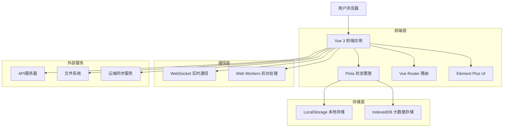
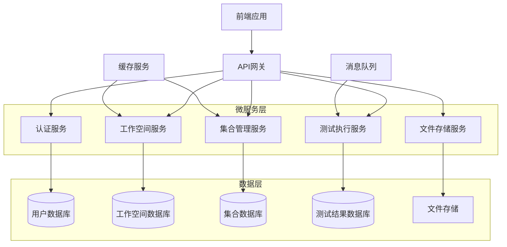
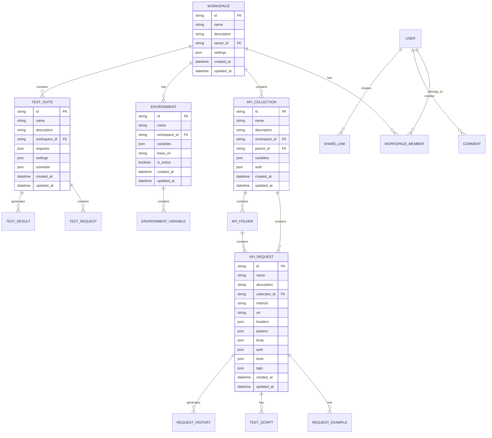

# 在线接口调试工具 - Full完全版技术架构文档

## 1. 架构设计



## 2. 技术描述

* **前端框架**：Vue 3.3+ + TypeScript 5.0+ + Vite 4.4+

* **UI组件库**：Element Plus 2.3+ + @element-plus/icons-vue 2.1+

* **状态管理**：Pinia 2.1+ + pinia-plugin-persistedstate

* **路由管理**：Vue Router 4.2+

* **HTTP客户端**：Axios 1.5+ + 自定义请求拦截器

* **代码编辑器**：Monaco Editor 0.41+ + @monaco-editor/loader

* **数据处理**：js-yaml 4.1+ + file-saver 2.0+ + jszip 3.10+

* **构建工具**：Vite + TypeScript + Sass 1.66+

* **测试框架**：Vitest + Vue Test Utils + Cypress

* **代码质量**：ESLint + Prettier + Husky + lint-staged

## 3. 路由定义

| 路由                   | 页面用途               |
| -------------------- | ------------------ |
| /                    | 重定向到工作空间首页         |
| /workspace           | 工作空间首页，显示项目概览和快速操作 |
| /workspace/:id       | 特定工作空间详情页面         |
| /collections         | API集合管理页面，展示所有集合   |
| /collections/:id     | 特定集合详情和编辑页面        |
| /debug               | 调试工作台，主要的API调试界面   |
| /debug/:requestId    | 特定请求的调试页面          |
| /environments        | 环境管理页面，配置多环境变量     |
| /history             | 历史记录页面，查看和管理请求历史   |
| /batch-test          | 批量测试页面，创建和执行测试套件   |
| /batch-test/:suiteId | 特定测试套件的详情页面        |
| /team                | 团队协作页面，成员和权限管理     |
| /data                | 数据管理页面，导入导出和同步     |
| /settings            | 设置页面，个人和工作空间配置     |
| /settings/workspace  | 工作空间设置子页面          |
| /settings/personal   | 个人设置子页面            |
| /share/:shareId      | 分享页面，查看分享的API文档    |

## 4. API定义

### 4.1 核心数据类型

```typescript
// 工作空间相关
interface Workspace {
  id: string
  name: string
  description: string
  ownerId: string
  members: WorkspaceMember[]
  settings: WorkspaceSettings
  createdAt: Date
  updatedAt: Date
}

interface WorkspaceMember {
  userId: string
  username: string
  email: string
  role: 'owner' | 'admin' | 'developer' | 'tester' | 'viewer'
  joinedAt: Date
  lastActiveAt: Date
}

// API集合相关
interface ApiCollection {
  id: string
  name: string
  description: string
  workspaceId: string
  parentId?: string
  requests: ApiRequest[]
  folders: ApiFolder[]
  variables: Record<string, any>
  auth?: AuthConfig
  createdAt: Date
  updatedAt: Date
}

interface ApiRequest {
  id: string
  name: string
  description: string
  method: HttpMethod
  url: string
  headers: Record<string, string>
  params: RequestParam[]
  body?: RequestBody
  auth?: AuthConfig
  tests: TestScript[]
  examples: RequestExample[]
  tags: string[]
  createdAt: Date
  updatedAt: Date
}

// 环境配置相关
interface Environment {
  id: string
  name: string
  workspaceId: string
  variables: EnvironmentVariable[]
  baseUrl: string
  isActive: boolean
  createdAt: Date
  updatedAt: Date
}

interface EnvironmentVariable {
  key: string
  value: string
  type: 'string' | 'number' | 'boolean' | 'secret'
  description?: string
  enabled: boolean
}

// 批量测试相关
interface TestSuite {
  id: string
  name: string
  description: string
  workspaceId: string
  requests: TestRequest[]
  settings: TestSettings
  schedule?: TestSchedule
  createdAt: Date
  updatedAt: Date
}

interface TestResult {
  id: string
  suiteId: string
  status: 'running' | 'passed' | 'failed' | 'cancelled'
  startTime: Date
  endTime?: Date
  results: RequestTestResult[]
  summary: TestSummary
}

// 团队协作相关
interface ShareLink {
  id: string
  workspaceId: string
  resourceType: 'collection' | 'request' | 'environment'
  resourceId: string
  permissions: SharePermission[]
  expiresAt?: Date
  createdBy: string
  createdAt: Date
}

interface Comment {
  id: string
  resourceType: 'request' | 'collection'
  resourceId: string
  content: string
  authorId: string
  authorName: string
  parentId?: string
  createdAt: Date
  updatedAt: Date
}
```

### 4.2 状态管理API

```typescript
// 工作空间Store
interface WorkspaceStore {
  // 状态
  currentWorkspace: Workspace | null
  workspaces: Workspace[]
  members: WorkspaceMember[]
  
  // 操作
  loadWorkspaces(): Promise<void>
  createWorkspace(workspace: CreateWorkspaceRequest): Promise<Workspace>
  updateWorkspace(id: string, updates: Partial<Workspace>): Promise<void>
  deleteWorkspace(id: string): Promise<void>
  switchWorkspace(id: string): Promise<void>
  inviteMember(email: string, role: string): Promise<void>
  updateMemberRole(userId: string, role: string): Promise<void>
  removeMember(userId: string): Promise<void>
}

// 集合Store
interface CollectionStore {
  // 状态
  collections: ApiCollection[]
  currentCollection: ApiCollection | null
  
  // 操作
  loadCollections(): Promise<void>
  createCollection(collection: CreateCollectionRequest): Promise<ApiCollection>
  updateCollection(id: string, updates: Partial<ApiCollection>): Promise<void>
  deleteCollection(id: string): Promise<void>
  duplicateCollection(id: string): Promise<ApiCollection>
  importCollection(data: ImportData): Promise<ApiCollection>
  exportCollection(id: string, format: ExportFormat): Promise<void>
}

// 请求Store
interface RequestStore {
  // 状态
  currentRequest: ApiRequest | null
  response: ApiResponse | null
  loading: boolean
  openTabs: RequestTab[]
  activeTabId: string
  
  // 操作
  sendRequest(request: ApiRequest, environment?: Environment): Promise<ApiResponse>
  saveRequest(request: ApiRequest): Promise<void>
  duplicateRequest(id: string): Promise<ApiRequest>
  deleteRequest(id: string): Promise<void>
  openTab(request: ApiRequest): void
  closeTab(tabId: string): void
  switchTab(tabId: string): void
}

// 环境Store
interface EnvironmentStore {
  // 状态
  environments: Environment[]
  activeEnvironment: Environment | null
  
  // 操作
  loadEnvironments(): Promise<void>
  createEnvironment(environment: CreateEnvironmentRequest): Promise<Environment>
  updateEnvironment(id: string, updates: Partial<Environment>): Promise<void>
  deleteEnvironment(id: string): Promise<void>
  switchEnvironment(id: string): void
  resolveVariables(text: string): string
}

// 历史Store
interface HistoryStore {
  // 状态
  history: RequestHistory[]
  favorites: RequestHistory[]
  
  // 操作
  loadHistory(): Promise<void>
  addToHistory(request: ApiRequest, response: ApiResponse): void
  addToFavorites(historyId: string): void
  removeFromFavorites(historyId: string): void
  clearHistory(): void
  searchHistory(query: string): RequestHistory[]
}

// 测试Store
interface TestStore {
  // 状态
  testSuites: TestSuite[]
  testResults: TestResult[]
  runningTests: string[]
  
  // 操作
  loadTestSuites(): Promise<void>
  createTestSuite(suite: CreateTestSuiteRequest): Promise<TestSuite>
  updateTestSuite(id: string, updates: Partial<TestSuite>): Promise<void>
  deleteTestSuite(id: string): Promise<void>
  runTestSuite(id: string): Promise<TestResult>
  stopTestSuite(id: string): Promise<void>
  loadTestResults(suiteId: string): Promise<void>
}
```

## 5. 服务器架构图



## 6. 数据模型

### 6.1 数据模型定义



### 6.2 数据定义语言

```sql
-- 工作空间表
CREATE TABLE workspaces (
    id UUID PRIMARY KEY DEFAULT gen_random_uuid(),
    name VARCHAR(255) NOT NULL,
    description TEXT,
    owner_id UUID NOT NULL,
    settings JSONB DEFAULT '{}',
    created_at TIMESTAMP WITH TIME ZONE DEFAULT NOW(),
    updated_at TIMESTAMP WITH TIME ZONE DEFAULT NOW()
);

-- 工作空间成员表
CREATE TABLE workspace_members (
    id UUID PRIMARY KEY DEFAULT gen_random_uuid(),
    workspace_id UUID NOT NULL REFERENCES workspaces(id) ON DELETE CASCADE,
    user_id UUID NOT NULL,
    username VARCHAR(255) NOT NULL,
    email VARCHAR(255) NOT NULL,
    role VARCHAR(50) NOT NULL CHECK (role IN ('owner', 'admin', 'developer', 'tester', 'viewer')),
    joined_at TIMESTAMP WITH TIME ZONE DEFAULT NOW(),
    last_active_at TIMESTAMP WITH TIME ZONE DEFAULT NOW(),
    UNIQUE(workspace_id, user_id)
);

-- API集合表
CREATE TABLE api_collections (
    id UUID PRIMARY KEY DEFAULT gen_random_uuid(),
    name VARCHAR(255) NOT NULL,
    description TEXT,
    workspace_id UUID NOT NULL REFERENCES workspaces(id) ON DELETE CASCADE,
    parent_id UUID REFERENCES api_collections(id) ON DELETE CASCADE,
    variables JSONB DEFAULT '{}',
    auth JSONB,
    created_at TIMESTAMP WITH TIME ZONE DEFAULT NOW(),
    updated_at TIMESTAMP WITH TIME ZONE DEFAULT NOW()
);

-- API请求表
CREATE TABLE api_requests (
    id UUID PRIMARY KEY DEFAULT gen_random_uuid(),
    name VARCHAR(255) NOT NULL,
    description TEXT,
    collection_id UUID NOT NULL REFERENCES api_collections(id) ON DELETE CASCADE,
    method VARCHAR(10) NOT NULL,
    url TEXT NOT NULL,
    headers JSONB DEFAULT '{}',
    params JSONB DEFAULT '[]',
    body JSONB,
    auth JSONB,
    tests JSONB DEFAULT '[]',
    tags JSONB DEFAULT '[]',
    created_at TIMESTAMP WITH TIME ZONE DEFAULT NOW(),
    updated_at TIMESTAMP WITH TIME ZONE DEFAULT NOW()
);

-- 环境表
CREATE TABLE environments (
    id UUID PRIMARY KEY DEFAULT gen_random_uuid(),
    name VARCHAR(255) NOT NULL,
    workspace_id UUID NOT NULL REFERENCES workspaces(id) ON DELETE CASCADE,
    variables JSONB DEFAULT '[]',
    base_url TEXT DEFAULT '',
    is_active BOOLEAN DEFAULT FALSE,
    created_at TIMESTAMP WITH TIME ZONE DEFAULT NOW(),
    updated_at TIMESTAMP WITH TIME ZONE DEFAULT NOW()
);

-- 请求历史表
CREATE TABLE request_history (
    id UUID PRIMARY KEY DEFAULT gen_random_uuid(),
    workspace_id UUID NOT NULL REFERENCES workspaces(id) ON DELETE CASCADE,
    request_id UUID REFERENCES api_requests(id) ON DELETE SET NULL,
    method VARCHAR(10) NOT NULL,
    url TEXT NOT NULL,
    headers JSONB DEFAULT '{}',
    body JSONB,
    response JSONB,
    status_code INTEGER,
    duration INTEGER,
    is_favorite BOOLEAN DEFAULT FALSE,
    created_at TIMESTAMP WITH TIME ZONE DEFAULT NOW()
);

-- 测试套件表
CREATE TABLE test_suites (
    id UUID PRIMARY KEY DEFAULT gen_random_uuid(),
    name VARCHAR(255) NOT NULL,
    description TEXT,
    workspace_id UUID NOT NULL REFERENCES workspaces(id) ON DELETE CASCADE,
    requests JSONB DEFAULT '[]',
    settings JSONB DEFAULT '{}',
    schedule JSONB,
    created_at TIMESTAMP WITH TIME ZONE DEFAULT NOW(),
    updated_at TIMESTAMP WITH TIME ZONE DEFAULT NOW()
);

-- 测试结果表
CREATE TABLE test_results (
    id UUID PRIMARY KEY DEFAULT gen_random_uuid(),
    suite_id UUID NOT NULL REFERENCES test_suites(id) ON DELETE CASCADE,
    status VARCHAR(20) NOT NULL CHECK (status IN ('running', 'passed', 'failed', 'cancelled')),
    start_time TIMESTAMP WITH TIME ZONE NOT NULL,
    end_time TIMESTAMP WITH TIME ZONE,
    results JSONB DEFAULT '[]',
    summary JSONB DEFAULT '{}',
    created_at TIMESTAMP WITH TIME ZONE DEFAULT NOW()
);

-- 分享链接表
CREATE TABLE share_links (
    id UUID PRIMARY KEY DEFAULT gen_random_uuid(),
    workspace_id UUID NOT NULL REFERENCES workspaces(id) ON DELETE CASCADE,
    resource_type VARCHAR(50) NOT NULL,
    resource_id UUID NOT NULL,
    permissions JSONB DEFAULT '[]',
    expires_at TIMESTAMP WITH TIME ZONE,
    created_by UUID NOT NULL,
    created_at TIMESTAMP WITH TIME ZONE DEFAULT NOW()
);

-- 评论表
CREATE TABLE comments (
    id UUID PRIMARY KEY DEFAULT gen_random_uuid(),
    resource_type VARCHAR(50) NOT NULL,
    resource_id UUID NOT NULL,
    content TEXT NOT NULL,
    author_id UUID NOT NULL,
    author_name VARCHAR(255) NOT NULL,
    parent_id UUID REFERENCES comments(id) ON DELETE CASCADE,
    created_at TIMESTAMP WITH TIME ZONE DEFAULT NOW(),
    updated_at TIMESTAMP WITH TIME ZONE DEFAULT NOW()
);

-- 创建索引
CREATE INDEX idx_workspace_members_workspace_id ON workspace_members(workspace_id);
CREATE INDEX idx_api_collections_workspace_id ON api_collections(workspace_id);
CREATE INDEX idx_api_requests_collection_id ON api_requests(collection_id);
CREATE INDEX idx_environments_workspace_id ON environments(workspace_id);
CREATE INDEX idx_request_history_workspace_id ON request_history(workspace_id);
CREATE INDEX idx_request_history_created_at ON request_history(created_at DESC);
CREATE INDEX idx_test_suites_workspace_id ON test_suites(workspace_id);
CREATE INDEX idx_test_results_suite_id ON test_results(suite_id);
CREATE INDEX idx_share_links_resource ON share_links(resource_type, resource_id);
CREATE INDEX idx_comments_resource ON comments(resource_type, resource_id);

-- 初始化数据
INSERT INTO workspaces (id, name, description, owner_id) VALUES 
('default', '默认工作空间', '系统默认工作空间', 'system');

INSERT INTO environments (id, name, workspace_id, base_url, is_active) VALUES 
('default-dev', '开发环境', 'default', 'http://localhost:3000', true),
('default-test', '测试环境', 'default', 'http://test.example.com', false),
('default-prod', '生产环境', 'default', 'https://api.example.com', false);
```

