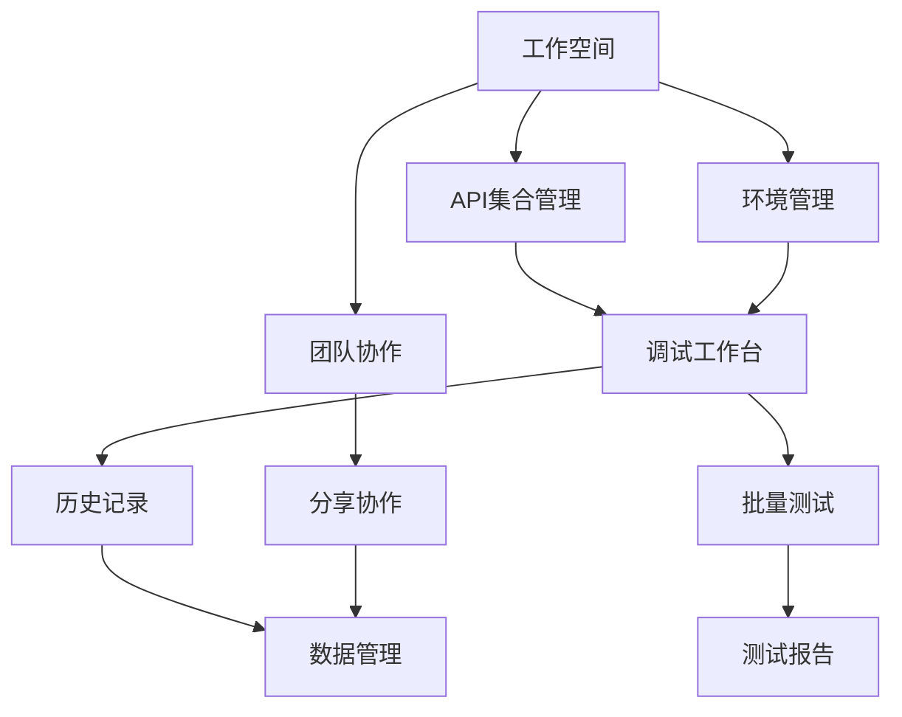

# 在线接口调试工具 - Full完全版产品需求文档

## 1. 产品概述

Full完全版是面向企业和团队的专业级API调试工具，提供完整的API开发生命周期管理功能。相比Lite版本，Full版本增加了工作空间管理、团队协作、批量测试、数据导入导出等企业级功能，满足大型项目和团队的复杂需求。

产品旨在提升团队API开发效率，支持多人协作，提供完整的API文档管理和测试自动化解决方案，帮助企业建立标准化的API开发流程。

## 2. 核心功能

### 2.1 用户角色

| 角色    | 注册方式    | 核心权限             |
| ----- | ------- | ---------------- |
| 管理员   | 系统初始化创建 | 工作空间管理、用户管理、全局设置 |
| 项目负责人 | 管理员邀请   | 项目管理、成员管理、集合管理   |
| 开发者   | 邀请码注册   | API调试、集合编辑、环境配置  |
| 测试人员  | 邀请码注册   | API测试、批量测试、报告查看  |
| 访客    | 分享链接访问  | 只读查看API文档和测试结果   |

### 2.2 功能模块

我们的Full版本包含以下主要页面：

1. **工作空间页面**：项目概览、快速操作、团队成员管理
2. **API集合页面**：集合管理、API组织、文档生成
3. **调试工作台**：请求配置、响应查看、实时调试
4. **环境管理页面**：多环境配置、变量管理、环境切换
5. **历史记录页面**：请求历史、收藏管理、搜索过滤
6. **批量测试页面**：测试套件、自动化测试、报告生成
7. **团队协作页面**：成员管理、权限配置、分享设置
8. **数据管理页面**：导入导出、备份恢复、同步设置
9. **设置页面**：个人设置、工作空间设置、系统配置

### 2.3 页面详情

| 页面名称    | 模块名称   | 功能描述                      |
| ------- | ------ | ------------------------- |
| 工作空间页面  | 项目概览   | 显示项目统计信息、最近活动、快速入口        |
| 工作空间页面  | 团队管理   | 成员列表、角色分配、邀请新成员           |
| 工作空间页面  | 快速操作   | 新建集合、导入数据、创建环境            |
| API集合页面 | 集合树    | 层级展示API集合、拖拽排序、批量操作       |
| API集合页面 | API编辑器 | 请求配置、参数设置、文档编写            |
| API集合页面 | 文档生成   | 自动生成API文档、导出多种格式          |
| 调试工作台   | 请求面板   | 方法选择、URL配置、参数设置、认证配置      |
| 调试工作台   | 响应面板   | 状态显示、数据展示、性能指标、错误分析       |
| 调试工作台   | 标签管理   | 多标签支持、会话保持、快速切换           |
| 环境管理页面  | 环境配置   | 创建环境、变量设置、基础URL配置         |
| 环境管理页面  | 变量管理   | 全局变量、环境变量、动态变量            |
| 环境管理页面  | 环境切换   | 快速切换、环境对比、变量预览            |
| 历史记录页面  | 历史列表   | 请求历史、时间筛选、状态过滤            |
| 历史记录页面  | 收藏管理   | 收藏请求、分类管理、快速访问            |
| 历史记录页面  | 搜索过滤   | 关键词搜索、高级筛选、排序功能           |
| 批量测试页面  | 测试套件   | 创建测试集、添加断言、配置流程           |
| 批量测试页面  | 执行引擎   | 并发执行、进度监控、错误处理            |
| 批量测试页面  | 报告生成   | 测试报告、性能分析、导出功能            |
| 团队协作页面  | 成员管理   | 添加成员、权限设置、活动监控            |
| 团队协作页面  | 分享功能   | 生成分享链接、权限控制、访问统计          |
| 团队协作页面  | 评论系统   | API评论、讨论功能、通知提醒           |
| 数据管理页面  | 导入功能   | 支持Postman、OpenAPI、cURL等格式 |
| 数据管理页面  | 导出功能   | 多格式导出、批量导出、定制模板           |
| 数据管理页面  | 同步设置   | 云端同步、版本控制、冲突解决            |
| 设置页面    | 个人设置   | 主题配置、快捷键、通知设置             |
| 设置页面    | 工作空间设置 | 基础信息、默认配置、安全设置            |
| 设置页面    | 系统配置   | 代理设置、SSL配置、性能优化           |

## 3. 核心流程

### 管理员流程

1. 创建工作空间 → 配置基础设置 → 邀请团队成员 → 分配角色权限 → 监控使用情况

### 项目负责人流程

1. 创建API集合 → 组织API结构 → 配置环境变量 → 分配开发任务 → 审核API文档

### 开发者流程

1. 选择工作环境 → 创建/编辑API → 配置请求参数 → 调试测试 → 保存到集合 → 生成文档

### 测试人员流程

1. 导入API集合 → 创建测试套件 → 配置测试用例 → 执行批量测试 → 查看测试报告 → 反馈问题

## 4. 用户界面设计

### 4.1 设计风格

* **主色调**：专业蓝 (#1890ff)、成功绿 (#52c41a)、警告橙 (#faad14)、错误红 (#ff4d4f)

* **辅助色**：中性灰 (#8c8c8c)、背景灰 (#f5f5f5)、边框灰 (#d9d9d9)

* **按钮样式**：圆角设计、悬停效果、加载状态、禁用状态

* **字体规范**：标题 16-24px、正文 14px、说明 12px、代码 Monaco字体

* **布局风格**：左侧导航、顶部工具栏、主内容区、右侧面板的经典布局

* **图标风格**：线性图标、统一尺寸、语义化设计

### 4.2 页面设计概览

| 页面名称    | 模块名称 | UI元素                   |
| ------- | ---- | ---------------------- |
| 工作空间页面  | 顶部导航 | Logo、工作空间选择器、用户头像、设置入口 |
| 工作空间页面  | 侧边栏  | 导航菜单、收起展开、活动指示器        |
| 工作空间页面  | 主内容区 | 卡片布局、统计图表、快速操作按钮       |
| API集合页面 | 集合树  | 树形结构、拖拽排序、右键菜单、搜索框     |
| API集合页面 | 编辑器  | 分栏布局、语法高亮、自动补全、实时预览    |
| 调试工作台   | 请求面板 | 表单布局、标签页、折叠面板、验证提示     |
| 调试工作台   | 响应面板 | 标签页、代码高亮、性能指标、下载按钮     |
| 环境管理页面  | 环境列表 | 表格布局、状态标识、操作按钮、批量操作    |
| 批量测试页面  | 测试配置 | 步骤向导、进度条、结果展示、报告下载     |

### 4.3 响应式设计

* **桌面端优先**：1200px以上为主要设计目标

* **平板适配**：768-1199px支持横屏使用

* **移动端支持**：320-767px提供基础功能

* **触控优化**：按钮尺寸、手势操作、滑动交互

* **自适应布局**：弹性网格、流式布局、断点设计

