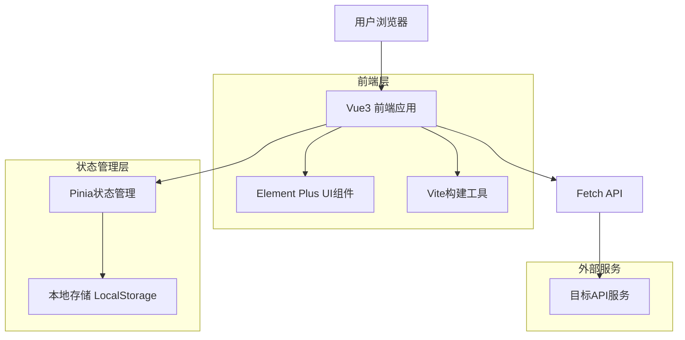
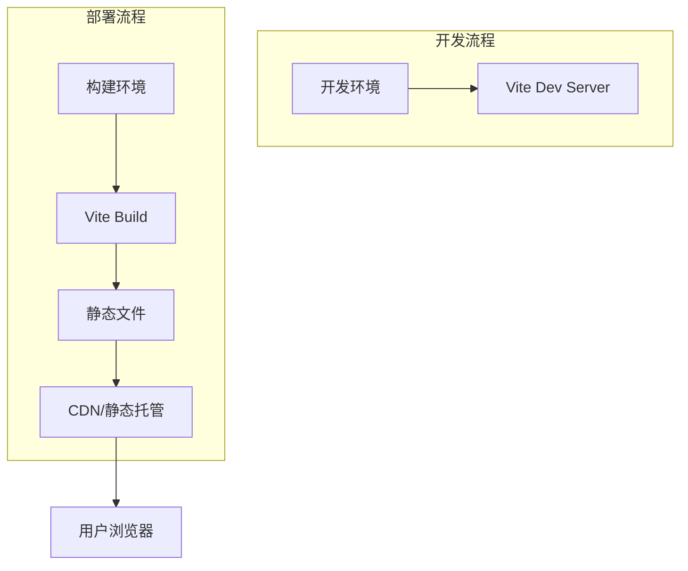
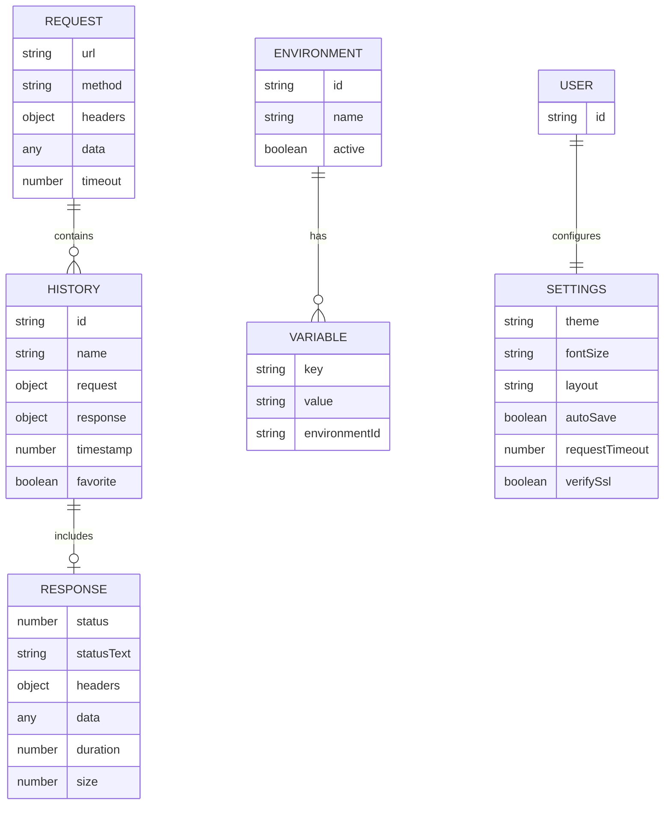

# 在线接口调试工具 Lite版本升级技术架构文档

## 1. 架构设计



## 2. 技术描述

* **前端框架**：Vue\@3.3.4 + TypeScript\@5.0.2 + Vite\@4.4.5

* **UI组件库**：Element Plus\@2.3.8 + @element-plus/icons-vue\@2.1.0

* **状态管理**：Pinia\@2.1.6

* **路由管理**：Vue Router\@4.2.4

* **HTTP客户端**：Axios\@1.5.0 + Fetch API

* **样式预处理**：Sass\@1.66.1

* **构建工具**：Vite + vue-tsc

## 3. 路由定义

| 路由            | 用途              |
| ------------- | --------------- |
| /             | 主界面，包含请求配置和响应展示 |
| /history      | 历史记录管理页面        |
| /environments | 环境管理页面          |
| /settings     | 设置配置页面          |

## 4. API定义

### 4.1 核心接口

由于这是一个纯前端应用，主要通过Fetch API与目标服务进行通信：

**发送HTTP请求**

```typescript
interface RequestConfig {
  url: string
  method: 'GET' | 'POST' | 'PUT' | 'DELETE' | 'PATCH' | 'HEAD' | 'OPTIONS'
  headers?: Record<string, string>
  data?: any
  timeout?: number
  followRedirects?: boolean
  verifySsl?: boolean
}

interface ResponseData {
  status: number
  statusText: string
  headers: Record<string, string>
  data: any
  duration: number
  size: number
}
```

### 4.2 本地存储接口

**历史记录存储**

```typescript
interface HistoryItem {
  id: string
  name?: string
  request: RequestConfig
  response?: ResponseData
  timestamp: number
  favorite?: boolean
}
```

**环境配置存储**

```typescript
interface Environment {
  id: string
  name: string
  variables: Record<string, string>
  active?: boolean
}
```

**用户设置存储**

```typescript
interface UserSettings {
  theme: 'light' | 'dark' | 'auto'
  fontSize: 'small' | 'medium' | 'large'
  layout: 'horizontal' | 'vertical'
  autoSave: boolean
  requestTimeout: number
  verifySsl: boolean
}
```

## 5. 服务器架构图

由于是纯前端应用，无需服务器架构，但需要考虑部署架构：



## 6. 数据模型

### 6.1 数据模型定义



### 6.2 本地存储结构

**LocalStorage数据结构**

```typescript
// 历史记录
const STORAGE_KEYS = {
  HISTORY: 'api-debug-history',
  ENVIRONMENTS: 'api-debug-environments', 
  SETTINGS: 'api-debug-settings',
  CURRENT_ENV: 'api-debug-current-env'
}

// 历史记录存储
interface StoredHistory {
  items: HistoryItem[]
  maxItems: number
}

// 环境配置存储
interface StoredEnvironments {
  environments: Environment[]
  currentId?: string
}

// 用户设置存储
interface StoredSettings extends UserSettings {
  version: string
  lastUpdated: number
}
```

### 6.3 状态管理Store结构

**请求状态Store**

```typescript
interface RequestStore {
  // 状态
  currentRequest: RequestConfig | null
  response: ResponseData | null
  loading: boolean
  
  // 方法
  sendRequest: (config: RequestConfig) => Promise<void>
  clearRequest: () => void
  clearResponse: () => void
}
```

**历史记录Store**

```typescript
interface HistoryStore {
  // 状态
  items: HistoryItem[]
  searchText: string
  filterType: string
  
  // 方法
  addItem: (item: HistoryItem) => void
  removeItem: (id: string) => void
  toggleFavorite: (id: string) => void
  clearHistory: () => void
  searchItems: (text: string) => HistoryItem[]
}
```

**环境管理Store**

```typescript
interface EnvironmentStore {
  // 状态
  environments: Environment[]
  currentEnvironment: Environment | null
  
  // 方法
  createEnvironment: (env: Omit<Environment, 'id'>) => void
  updateEnvironment: (id: string, env: Partial<Environment>) => void
  deleteEnvironment: (id: string) => void
  switchEnvironment: (id: string) => void
  resolveVariables: (text: string) => string
}
```

**设置Store**

```typescript
interface SettingsStore {
  // 状态
  settings: UserSettings
  
  // 方法
  updateSettings: (settings: Partial<UserSettings>) => void
  resetSettings: () => void
  exportSettings: () => string
  importSettings: (data: string) => void
}
```

