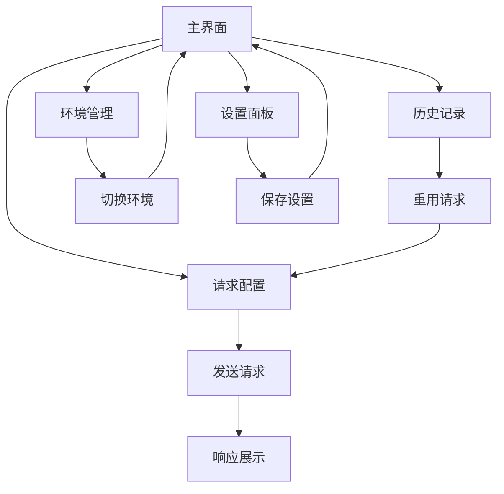

# 在线接口调试工具 Lite版本升级产品需求文档

## 1. 产品概述

在线接口调试工具Lite版本是一个轻量级的API测试工具，基于Vue3+Element Plus构建，为开发者提供简洁高效的接口调试体验。本次升级旨在提升用户体验、增强功能完整性，并优化界面设计，使其更加现代化和易用。

升级目标：打造一个功能完备、界面美观、性能优异的轻量级接口调试工具，满足开发者日常API测试需求。

## 2. 核心功能

### 2.1 用户角色

本产品面向开发者，无需复杂的用户角色区分，所有功能对所有用户开放。

### 2.2 功能模块

升级后的Lite版本包含以下主要页面：

1. **主界面**：统一的工作台，包含请求配置区域和响应展示区域
2. **历史记录面板**：请求历史管理和快速重用
3. **环境管理面板**：多环境配置和切换
4. **设置面板**：个性化配置和偏好设置

### 2.3 页面详情

| 页面名称   | 模块名称   | 功能描述                                   |
| ------ | ------ | -------------------------------------- |
| 主界面    | 请求配置面板 | 支持HTTP方法选择、URL输入、参数配置、请求头设置、认证配置、请求体编辑 |
| 主界面    | 响应展示面板 | 响应状态显示、响应体美化展示、响应头查看、Cookie解析、性能指标展示   |
| 主界面    | 工具栏    | 快速操作按钮、环境切换、历史记录入口、设置入口                |
| 历史记录面板 | 历史列表   | 请求历史展示、搜索过滤、快速重用、收藏管理                  |
| 历史记录面板 | 历史详情   | 历史请求详情查看、对比功能                          |
| 环境管理面板 | 环境列表   | 环境创建、编辑、删除、切换                          |
| 环境管理面板 | 变量管理   | 环境变量配置、全局变量设置                          |
| 设置面板   | 界面设置   | 主题切换、字体大小、布局偏好                         |
| 设置面板   | 功能设置   | 自动保存、请求超时、SSL验证等配置                     |

## 3. 核心流程

### 主要用户操作流程：

1. **基础请求流程**：用户进入主界面 → 配置请求参数 → 发送请求 → 查看响应结果
2. **环境切换流程**：用户点击环境切换 → 选择目标环境 → 自动应用环境变量 → 继续请求操作
3. **历史管理流程**：用户查看历史记录 → 选择历史请求 → 快速重用或编辑 → 发送新请求
4. **设置配置流程**：用户进入设置面板 → 调整个人偏好 → 保存设置 → 返回主界面

## 4. 用户界面设计

### 4.1 设计风格

* **主色调**：蓝色系 (#409EFF 主色，#E6F7FF 浅色背景)

* **辅助色**：灰色系 (#909399 文本，#F5F7FA 背景)

* **状态色**：成功绿色 (#67C23A)，警告橙色 (#E6A23C)，错误红色 (#F56C6C)

* **按钮风格**：圆角设计，渐变效果，悬停动画

* **字体**：主要使用 'Helvetica Neue', 'PingFang SC'，代码区域使用 'Monaco', 'Menlo'

* **布局风格**：卡片式设计，响应式布局，左右分栏或上下分栏

* **图标风格**：Element Plus图标库，线性风格，统一尺寸

### 4.2 页面设计概览

| 页面名称   | 模块名称   | UI元素                                   |
| ------ | ------ | -------------------------------------- |
| 主界面    | 顶部工具栏  | 品牌Logo、环境选择器、历史记录按钮、设置按钮、主题切换          |
| 主界面    | 请求配置面板 | 方法选择下拉框、URL输入框、标签页（参数/请求头/认证/请求体）、发送按钮 |
| 主界面    | 响应展示面板 | 状态标签、性能指标、标签页（响应体/响应头/Cookie/测试）、操作按钮组 |
| 历史记录面板 | 侧边栏    | 搜索框、过滤器、历史列表、收藏夹                       |
| 环境管理面板 | 环境配置   | 环境列表、变量表格、添加/编辑表单                      |
| 设置面板   | 配置选项   | 分组设置项、开关控件、选择器、滑块                      |

### 4.3 响应式设计

* **桌面优先**：主要针对桌面端开发者使用场景

* **移动适配**：支持平板和手机访问，采用上下布局

* **触摸优化**：按钮尺寸适配触摸操作，手势支持

